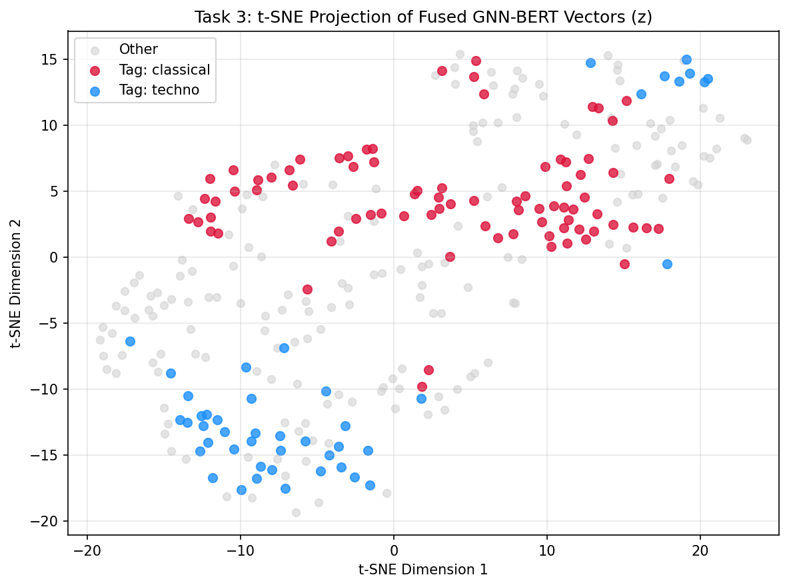

# GNN-Based BERT for Understanding Context from Music

**Course:** CSE425 / EEE474 / CSE715 Neural Networks  
**Dataset:** MagnaTagATune (3,000 clips, top-50 tags)  
**Architecture:** Multimodal Cross-Attention (DistilBERT + GraphSAGE GNN)

---

##  Overview
This repository implements a multimodal neural network architecture that combines structural audio graph representations (GraphSAGE on 3-second audio segment graphs) with natural language tag context (DistilBERT) to perform multi-label music tagging and context understanding.

---

##  Performance & Ablation Results

| Model / Architecture | Macro-F1 | Micro-F1 | Key Insight |
| :--- | :---: | :---: | :--- |
| **B1: Majority Class Baseline** | 0.021 | 0.161 | Naïve tag prior baseline |
| **B2: Mel-Spectrogram CNN** | 0.229 | 0.354 | Standard 2D spectral audio model |
| **Task 1: BERT-Only (Text Context)** | 0.190 | 0.336 | Text sequence representation |
| **Task 2: GraphSAGE GNN (Audio Graph)** | 0.216 | 0.413 | Temporal segment graph learning |
| **Task 3: Cross-Attention GNN-BERT Fusion** | **0.292** | **0.472** | **Best overall multimodal model** |

---

## 📈 Latent Space Visualization
Below is the t-SNE projection of the cross-attention fused embeddings $z$, highlighting clear topological separation between contrasting genres (`classical` vs. `techno`):

---

##  Repository Directory Structure
gnn-bert-music-context/
├── notebooks/
│   └── demo_context.ipynb         # End-to-end execution notebook
├── data/
│   └── processed/
│       └── graphs/                # Preprocessed PyTorch Geometric graph samples (.pt)
├── results/
│   └── plots/
│       └── task3_tsne_fused.png   # Latent space visualization
└── README.md

##  Quickstart
1. Open `notebooks/demo_context.ipynb` in Google Colab or Kaggle.
2. Execute all cells sequentially to build segment graphs, train model variants, and reproduce evaluation metrics and case studies.
